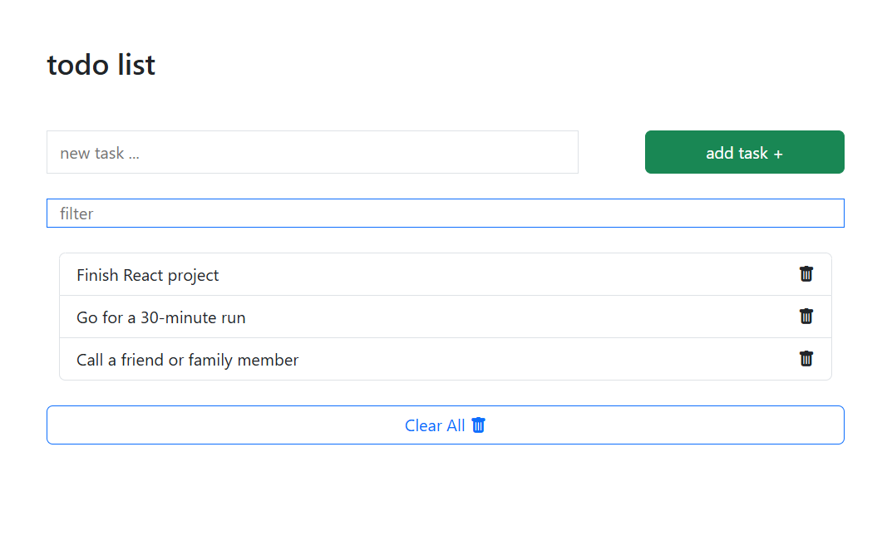

# Todo List App with JavaScript

A simple **Todo List** application built with HTML, CSS(bootstrap), and JavaScript.  
This app allows you to **add, delete, filter tasks** and **store them in LocalStorage**.

---

## Features

- Add new tasks
- Delete individual tasks
- Clear all tasks
- Filter tasks by search
- Automatic LocalStorage saving to keep tasks after page refresh

---

## Preview (Demo)

## Screenshot

